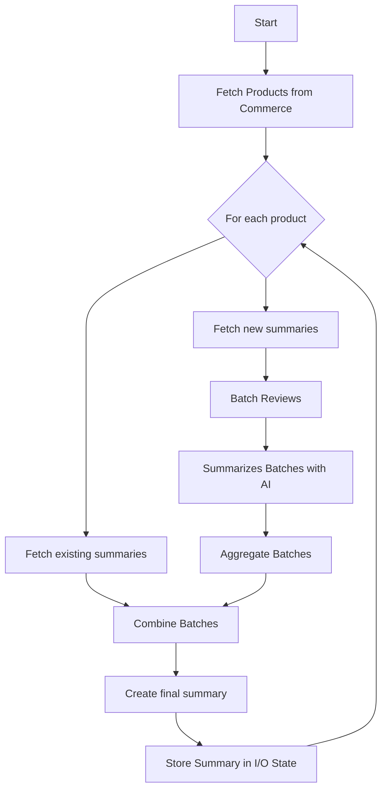

# Product Reviews Summarizer

This application is a product review summarization service built using Adobe App Builder, Adobe Commerce, and OpenAI. It fetches product reviews, generates summaries using AI, and exposes a REST API to retrieve these summaries.

> **Note**: You'll need to provide your own OpenAI API key. Langfuse integration is optional but recommended for AI call tracking and cost monitoring.

## Table of Contents

- [Product Processing Workflow](#product-processing-workflow)
- [High-Level Architecture](#high-level-architecture)
- [Actions](#actions)
- [Multi-Language Support](#multi-language-support)
- [API Usage](#api-usage)
  - [REST API](#rest-api)
  - [GraphQL API](#graphql-api)
- [Project Structure](#project-structure)
- [Setup](#setup)
  - [Create App Builder Project](#create-app-builder-project)
  - [Configuration](#configuration)
  - [Project Setup](#project-setup)
- [Available Scripts](#available-scripts)
- [Deployment](#deployment)
- [Useful Commands](#useful-commands)

## Product Processing Workflow

The application processes product reviews through an automated workflow designed to handle large-scale review analysis cost-effectively:

### Scheduled Processing

- **Daily Execution**: The system runs on a cron schedule once per day
- **Cost Optimization**: Daily batching minimizes expensive LLM API calls by processing reviews in bulk rather than real-time
- **Manual Triggering**: Can also be triggered manually via the `process-worker` action for on-demand processing

### Processing Steps

1.  **Store Iteration**: Based on the `COMMERCE_STORE_CODES` environment variable, the system iterates through each configured store
2.  **Product Retrieval**: For each store, retrieves all active products from Adobe Commerce using the REST API (paginated at 100 products per page)
3.  **Incremental Processing**: For each product, fetches only new reviews since the last processing timestamp to avoid reprocessing
4.  **Native Language Processing**: Reviews are processed in their original language and summarized in the store's configured `targetLanguage`
5.  **Batch Processing**: Reviews are grouped into batches and sent to OpenAI for initial summarization
6.  **Final Aggregation**: All batch summaries (including existing ones) are aggregated into a single comprehensive product summary
7.  **Storage**: Final summaries are stored in Adobe I/O State with a 30-day TTL, indexed by store code and product ID

### Summary Retrieval

- **REST API**: Summaries can be retrieved via the `reviews-api` action using store code and product ID
- **GraphQL API**: The API Mesh transforms the REST endpoint into a GraphQL interface for flexible querying
- **Multi-language Support**: Each store maintains summaries in its configured target language for localized customer experiences

## Workflow Diagram



## High-Level Architecture

The application is built on Adobe App Builder and consists of several serverless actions. It integrates with the following services:

- **Adobe Commerce**: For fetching product and review data.
- **OpenAI**: For generating AI-powered summaries of the reviews.
- **Adobe I/O State**: For storing the generated summaries.
- **Langfuse**: For tracing and debugging the AI prompts and responses.
- **promptfoo**: For evaluating and testing the quality of AI prompts used in both batch processing and final aggregation stages.

## Actions

The application defines the following actions in `app.config.yaml`:

- `process`: This is the main action that orchestrates the entire summarization workflow. It can be triggered manually.
- `process-worker`: A web-accessible action that triggers the `process` action for on-demand processing.
- `reviews-api`: An action that exposes a REST endpoint to retrieve the stored review summaries for a given product.
- `debug`: A utility action for debugging purposes.

## Multi-Language Support

The application supports native language processing for authentic, culturally appropriate summaries:

### How It Works

1. **English prompts with target language output** - Prompt instructions remain in English for consistency and reliability, but the AI processes reviews in their native language and outputs summaries in the target language
2. **Preserves authentic customer expressions** - No translation loss, maintains original sentiment and cultural context
3. **Direct processing** - Polish reviews → Polish summaries, German reviews → German summaries, etc.
4. **Single summary storage** - Each product gets one summary in the configured target language

### Benefits

- **Authentic results**: No translation artifacts, preserves native idioms and expressions
- **Cultural context**: AI understands language-specific sentiment nuances directly
- **Performance**: Single-pass processing, no separate translation steps
- **Consistency**: English prompts ensure reliable instruction following across all languages

### Configuration

Configure stores in the `COMMERCE_STORE_CODES` environment variable. Each store must specify a `targetLanguage` and can optionally specify a custom `storeUrl`:

#### Single Domain Setup (Traditional)

For stores that share the same Adobe Commerce domain:

```json
[
  { "storeCode": "pl", "targetLanguage": "Polish" },
  { "storeCode": "de", "targetLanguage": "German" },
  { "storeCode": "us", "targetLanguage": "English" },
  { "storeCode": "ca", "targetLanguage": "Simplified Chinese" }
]
```

#### Multi-Domain Setup

For stores that have different Adobe Commerce domains:

```json
[
  {
    "storeCode": "pl",
    "targetLanguage": "Polish",
    "storeUrl": "https://pl.mystore.com"
  },
  {
    "storeCode": "de",
    "targetLanguage": "German",
    "storeUrl": "https://de.mystore.com"
  },
  {
    "storeCode": "us",
    "targetLanguage": "English",
    "storeUrl": "https://us.mystore.com"
  }
]
```

#### Mixed Setup

You can mix stores with and without custom URLs:

```json
[
  {
    "storeCode": "pl",
    "targetLanguage": "Polish",
    "storeUrl": "https://separate-polish-site.com"
  },
  {
    "storeCode": "de",
    "targetLanguage": "German"
  },
  {
    "storeCode": "us",
    "targetLanguage": "English"
  }
]
```

**Configuration Notes:**

- **`targetLanguage: "English"`**: Standard English processing
- **Other languages**: Native language processing for authentic results
- **`storeUrl`** (optional): When provided, this URL will be used instead of the global `COMMERCE_BASE_URL` for that specific store
- **Fallback behavior**: If `storeUrl` is not specified, the store will use the global `COMMERCE_BASE_URL`

Use descriptive language names (e.g., "Brazilian Portuguese", "Simplified Chinese") to help the AI understand the target language better. If `targetLanguage` is empty or missing, it defaults to English.

## API Usage

You can retrieve the generated summaries using either the REST API or the GraphQL API Mesh.

### REST API

To get the summary for a specific product, make a GET request to the following endpoint:

`/api/v1/web/product-reviews-summarizer/reviews-api`

**Example using cURL:**

```bash
# Get summary for store "gb" (English if no targetLanguage configured)
curl https://<your-app-url>/api/v1/web/product-reviews-summarizer/reviews-api?storeCode=gb&productId=4071154

# Get summary for Polish store (native Polish summary)
curl https://<your-app-url>/api/v1/web/product-reviews-summarizer/reviews-api?storeCode=pl&productId=4071154
```

### GraphQL API

The API Mesh transforms the REST API into a GraphQL interface. You can use the following query to fetch a summary:

```graphql
# Get summary for English store
query {
  api_v1_web_product_reviews_summarizer_reviews_api(storeCode: "gb", productId: "4071154") {
    summary
    reviewCount
    timestamp
    processId
  }
}

# Get summary for Polish store (native Polish summary)
query {
  api_v1_web_product_reviews_summarizer_reviews_api(storeCode: "pl", productId: "4071154") {
    summary
    reviewCount
    timestamp
    processId
  }
}
```

## Project Structure

- `actions-src/`: Contains the TypeScript source code for all the actions.
- `actions/`: Contains the compiled JavaScript code. This directory is generated from `actions-src/` and is the one deployed to Adobe I/O Runtime.
- `test/`: Contains unit tests and test data.
- `scripts/`: Contains utility scripts, such as for copying prompt files.
- `app.config.yaml`: The main configuration file for the Adobe App Builder application.
- `package.json`: Defines the project's dependencies and scripts.

## Setup

### Create App Builder Project

Go to the [Adobe developer console](https://developer.adobe.com/console) portal

- Click on `Create project from template`
- Select `App Builder`
- Choose a name and title
- Select stage workspace or create a new one
- Add the following API services (select default OAuth server to server):
  - I/O Events
  - I/O Management API

## Configuration

> [!NOTE]
> When configuring the `COMMERCE_BASE_URL` environment variable, the format differs between PaaS and SaaS:
>
> For PaaS (On-Premise/Cloud):
>
> - Must include your base site URL + `/rest/` suffix
> - Example: `https://[environment-name].us-4.magentosite.cloud/rest/`
>
> For SaaS:
>
> - Must be the REST API endpoint provided by Adobe Commerce
> - Example: `https://na1-sandbox.api.commerce.adobe.com/[tenant-id]/`
>
> Make sure to use your actual environment name or tenant ID in the URL. The examples above use placeholder values.

### Supported Auth types

With the new announcement of **Adobe Commerce as a Cloud Service** (ACCS), requests to Commerce will now use different authentication strategies depending on the flavor you're using:

- If you're using the traditional Adobe Commerce Platform (PaaS) offering, you'll need to authenticate via OAuth1, like you've been doing until now.

- If you're using the new cloud service (SaaS) offering, you'll need to authenticate your requests using [Adobe Identity Management System](https://experienceleague.adobe.com/en/docs/experience-manager-learn/foundation/authentication/adobe-ims-authentication-technical-video-understand) (IMS).

#### \[PaaS\] Commerce OAuth1 - Configure a new Integration in Commerce

Configure a new Integration to secure the calls to Commerce from App Builder using OAuth by following these steps:

- In the Commerce Admin, navigate to System > Extensions > Integrations.
- Click the `Add New Integration` button. The following screen displays
  
- Give the integration a name. The rest of the fields can be left blank.
- Select API on the left and grant access to all the resources.
  
- Click Save.
- In the list of integrations, activate your integration.
- To configure the starter kit, you will need the integration details (consumer key, consumer secret, access token, and access token secret).

Store the credentials in the `.env` file, these are the minimum required values:

```dotenv
COMMERCE_CONSUMER_KEY=
COMMERCE_CONSUMER_SECRET=
COMMERCE_ACCESS_TOKEN=
COMMERCE_ACCESS_TOKEN_SECRET=
```

#### \[SaaS\] IMS OAuth - Add the OAuth Server to Server credentials to the environment

Configure a new IMS OAuth Server to Server following this [documentation](https://developer.adobe.com/developer-console/docs/guides/authentication/ServerToServerAuthentication/implementation/#setting-up-the-oauth-server-to-server-credential/)

Store the credentials in the `.env` file, these are the minimum required values:

```dotenv
OAUTH_CLIENT_ID=<string> # Your client ID
OAUTH_CLIENT_SECRET=<string> # Your client secret
OAUTH_SCOPES=<array> # ['scope1', 'scope2']
```

These are optional values that can be provided:

```dotenv
OAUTH_HOST=<string> # default: https://ims-na1.adobelogin.com
```

#### How to use one or another?

The starter kit is designed to work with both offerings, but only one of them at the same time. By default, (and to prevent breaking changes) the SaaS offering is opt-in, which means that you will need to explicitly configure it in order to start using it. **OAuth1** will be the first authentication mechanism tried before **IMS**.

- If you want to use PaaS follow the [first guide above](#paas-commerce-oauth1---configure-a-new-integration-in-commerce) and make sure your environment variables `COMMERCE_XXXX` are set correctly in the `.env` file.

- If you want to use SaaS follow the [latter guide above](#saas-ims-oauth---add-the-oauth-server-to-server-credentials-to-the-environment) and make sure the environment variables `COMMERCE_XXXX` are **NOT SET** (blank) or deleted from the `.env` file.

> [!NOTE]
> You'll notice that the `app.config.yaml` has both types of environment variables declared (those are the ones that end up in the runtime action context). The code is built to work regardless of the offering you've configured, so you shouldn't need to modify anything in that file unless you want to do some cleanup.

### Project Setup

1.  **Clone the repository.**

2.  **Login to App Builder:**

    ```bash
    aio login
    ```

3.  **Choose project and workspace:**

    ```bash
    aio console project select
    aio console workspace select
    ```

4.  **Sync your local application with the App Builder project:**

    ```bash
    aio app use --merge
    ```

5.  **Install dependencies:**

    ```bash
    npm install
    ```

6.  **Build the project:**

    ```bash
    npm run build
    ```

    For development with watch mode:

    ```bash
    npm run watch
    ```

7.  **Create a `.env` file** in the root of the project and populate it with the necessary credentials and configuration:

    ```env
    COMMERCE_BASE_URL=https://default.mystore.com
    COMMERCE_CONSUMER_KEY=
    COMMERCE_CONSUMER_SECRET=
    COMMERCE_ACCESS_TOKEN=
    COMMERCE_ACCESS_TOKEN_SECRET=
    COMMERCE_STORE_CODES=[{"storeCode": "gb", "targetLanguage": "English"}, {"storeCode": "pl", "targetLanguage": "Polish", "storeUrl": "https://pl.mystore.com"}, {"storeCode": "de", "targetLanguage": "German", "storeUrl": "https://de.mystore.com"}]
    REVIEWS_API_URL=
    OPENAI_API_KEY=
    LANGFUSE_SECRET_KEY=
    LANGFUSE_PUBLIC_KEY=
    LANGFUSE_BASE_URL=
    ```

#### Required API Keys

**OpenAI API Key**: You must obtain your own OpenAI API key from [OpenAI's platform](https://platform.openai.com/api-keys). This application does not provide OpenAI keys - you'll need to create an OpenAI account and generate an API key with sufficient credits for your usage.

#### Optional: Langfuse Integration

[Langfuse](https://langfuse.com/) is an optional but highly recommended observability platform for LLM applications that provides:

- **AI Call Tracking**: Monitor all OpenAI API calls in real-time
- **Cost Analysis**: Track spending and token usage across different operations
- **Performance Monitoring**: Analyze response times and success rates
- **Prompt Management**: Version and evaluate prompt effectiveness
- **Debug Capabilities**: Detailed logging for troubleshooting AI interactions

If you choose not to configure Langfuse, the application will still work normally but without these observability features. To set up Langfuse:

1. Create a free account at [Langfuse](https://langfuse.com/)
2. Create a new project
3. Copy the Secret Key, Public Key, and Base URL to your `.env` file

If you prefer not to use Langfuse, simply leave the `LANGFUSE_*` environment variables empty or remove them from your `.env` file.

        **Note:** The `COMMERCE_BASE_URL` serves as the default/fallback URL for stores that don't specify a custom `storeUrl`. Each store in `COMMERCE_STORE_CODES` can optionally override this with their own domain by specifying a `storeUrl` property.

#### Reviews API Configuration

The `REVIEWS_API_URL` should point to an endpoint that returns reviews data in the format defined in `actions-src/types/review.ts`. The API should return a `ReviewsResponse` object with the following exact structure:

```typescript
interface ReviewsResponse {
  reviews: Review[];
  pagination: Pagination;
  averageScore: number;
  totalReviews: number;
}

interface Review {
  id: string;
  score: number;
  content: string;
  title: string;
  createdAt: string;
}

interface Pagination {
  page: number;
  perPage: number;
  total: number;
}
```

The application will fetch reviews from this endpoint and use the data for AI-powered summarization.

    **Reference Implementation:** For a working example of a reviews API that returns data in this format, see: https://github.com/vaimo/product-reviews-summarizer-mock-api

8.  **Deploy the application:**
    ```bash
    aio app deploy
    ```

## Available Scripts

- `npm run build`: Compiles the TypeScript code from `actions-src/` to `actions/`.
- `npm run watch`: Watches for changes in `actions-src/` and recompiles automatically.
- `npm run lint`: Lints the TypeScript code.
- `npm test`: Runs the unit tests.
- `npm run eval-prompts`: Evaluates the quality of the AI prompts using `promptfoo`.

## Deployment

- **Deploy the application:**
  ```bash
  aio app deploy
  ```
- **Undeploy the application:**
  ```bash
  aio app undeploy
  ```

## Useful Commands

### Runtime Configuration

There is a default limit of 60 seconds for all actions. That's why we created the `process-worker` action so we can use OpenWhisk to avoid blocking the call and utilize the maximum 300000ms (5 minutes) timeout. You need to explicitly run the following command after deployment:

### Increase Runtime Timeout

```bash
aio rt action update product-reviews-summarizer/process -t 300000
```

### API Mesh Setup

To create and update the API mesh:

```bash
aio api-mesh:update -c mesh.json --env .env
```
