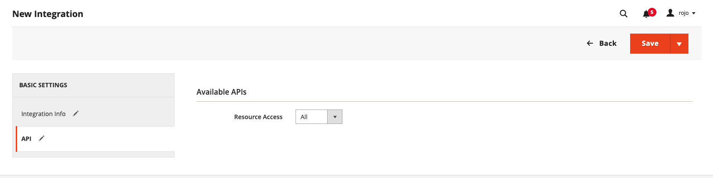

# Product Reviews Summarizer

This application is a product review summarization service built using Adobe App Builder, Adobe Commerce, and OpenAI. It fetches product reviews, generates summaries using AI, and exposes a REST API to retrieve these summaries.

> **Note**: You'll need to provide your own OpenAI API key. Langfuse integration is optional but recommended for AI call tracking and cost monitoring.

## Table of Contents

- [Product Processing Workflow](#product-processing-workflow)
- [High-Level Architecture](#high-level-architecture)
- [Actions](#actions)
- [Multi-Language Support](#multi-language-support)
- [Project Structure](#project-structure)
- [Configuration](#configuration)
  - [Environment Variables](#environment-variables)
  - [Authentication: PaaS vs SaaS](#authentication-paas-vs-saas)
  - [Store Codes Example](#store-codes-example)
  - [Langfuse (Optional)](#langfuse-optional)
  - [Reviews API Format](#reviews-api-format)
- [API Usage](#api-usage)
  - [REST API](#rest-api)
  - [GraphQL API](#graphql-api)
- [Project Setup](#project-setup)
- [For Developers](#for-developers)
  - [Available Scripts](#available-scripts)
  - [Useful Commands](#useful-commands)
    - [Runtime Configuration](#runtime-configuration)
    - [Increase Runtime Timeout](#increase-runtime-timeout)
    - [API Mesh Setup](#api-mesh-setup)

## Product Processing Workflow

The application processes product reviews through an automated workflow designed to handle large-scale review analysis cost-effectively:

### Scheduled Processing

- **Daily Execution**: The system runs on a cron schedule once per day
- **Cost Optimization**: Daily batching minimizes expensive LLM API calls by processing reviews in bulk rather than real-time
- **Manual Triggering**: Can also be triggered manually via the `process-worker` action for on-demand processing

### Processing Steps

1.  **Store Iteration**: Based on the `COMMERCE_STORE_CODES` environment variable, the system iterates through each configured store
2.  **Product Retrieval**: For each store, retrieves all active products from Adobe Commerce using the REST API (paginated at 100 products per page)
3.  **Incremental Processing**: For each product, fetches only new reviews since the last processing timestamp to avoid reprocessing
4.  **Native Language Processing**: Reviews are processed in their original language and summarized in the store's configured `targetLanguage`
5.  **Batch Processing**: Reviews are grouped into batches and sent to OpenAI for initial summarization
6.  **Final Aggregation**: All batch summaries (including existing ones) are aggregated into a single comprehensive product summary
7.  **Storage**: Final summaries are stored in Adobe I/O State with a 30-day TTL, indexed by store code and product ID

### Summary Retrieval

- **REST API**: Summaries can be retrieved via the `reviews-api` action using store code and product ID
- **GraphQL API**: The API Mesh transforms the REST endpoint into a GraphQL interface for flexible querying
- **Multi-language Support**: Each store maintains summaries in its configured target language for localized customer experiences

## Workflow Diagram


## High-Level Architecture

The application is built on Adobe App Builder and consists of several serverless actions. It integrates with the following services:

- **Adobe Commerce**: For fetching product and review data.
- **OpenAI**: For generating AI-powered summaries of the reviews.
- **Adobe I/O State**: For storing the generated summaries.
- **Langfuse**: For tracing and debugging the AI prompts and responses.
- **promptfoo**: For evaluating and testing the quality of AI prompts used in both batch processing and final aggregation stages.

## Actions

- `process`: This is the main action that orchestrates the entire summarization workflow. It is a non-web action that runs automatically on a daily schedule and is not directly callable manually.
- `process-worker`: A web-accessible action that can be used to manually trigger the functionality of the `process` action for on-demand processing.
- `reviews-api`: An action that exposes a REST endpoint to retrieve the stored review summaries for a given product.
- `debug`: A utility action for debugging purposes.

## Multi-Language Support

The application supports native language processing for authentic, culturally appropriate summaries:

### How It Works

1. **English prompts with target language output** - Prompt instructions remain in English for consistency and reliability, but the AI processes reviews in their native language and outputs summaries in the target language
2. **Preserves authentic customer expressions** - No translation loss, maintains original sentiment and cultural context
3. **Direct processing** - Polish reviews → Polish summaries, German reviews → German summaries, etc.
4. **Single summary storage** - Each product gets one summary in the configured target language

### Benefits

- **Authentic results**: No translation artifacts, preserves native idioms and expressions
- **Cultural context**: AI understands language-specific sentiment nuances directly
- **Performance**: Single-pass processing, no separate translation steps
- **Consistency**: English prompts ensure reliable instruction following across all languages

## Configuration

> **IMPORTANT:** All configuration is done by setting environment variables directly in your deployment environment (e.g., via the Adobe App Builder Console or your cloud provider's UI). You do **not** need to create a `.env` file or install the app locally.

### Environment Variables

| Variable Name                  | Required | Description                                                | Example Value                                                                                                                               |
| ------------------------------ | -------- | ---------------------------------------------------------- | ------------------------------------------------------------------------------------------------------------------------------------------- |
| `COMMERCE_BASE_URL`            | Yes      | Base URL for your Adobe Commerce REST API.                 | `https://default.mystore.com`                                                                                                               |
| `COMMERCE_CONSUMER_KEY`        | Cond.    | OAuth1 Consumer Key (PaaS only).                           | `your_consumer_key`                                                                                                                         |
| `COMMERCE_CONSUMER_SECRET`     | Cond.    | OAuth1 Consumer Secret (PaaS only).                        | `your_consumer_secret`                                                                                                                      |
| `COMMERCE_ACCESS_TOKEN`        | Cond.    | OAuth1 Access Token (PaaS only).                           | `your_access_token`                                                                                                                         |
| `COMMERCE_ACCESS_TOKEN_SECRET` | Cond.    | OAuth1 Access Token Secret (PaaS only).                    | `your_access_token_secret`                                                                                                                  |
| `COMMERCE_STORE_CODES`         | Yes      | JSON array of store configs (see below).                   | `[{"storeCode": "gb", "targetLanguage": "English"}, {"storeCode": "pl", "targetLanguage": "Polish", "storeUrl": "https://pl.mystore.com"}]` |
| `REVIEWS_API_URL`              | Yes      | Endpoint returning product reviews in the required format. | `https://your-reviews-api.com/reviews`                                                                                                      |
| `OPENAI_API_KEY`               | Yes      | Your OpenAI API key.                                       | `sk-...`                                                                                                                                    |
| `LANGFUSE_SECRET_KEY`          | No       | (Optional) Langfuse secret key for observability.          | `your_langfuse_secret_key`                                                                                                                  |
| `LANGFUSE_PUBLIC_KEY`          | No       | (Optional) Langfuse public key for observability.          | `your_langfuse_public_key`                                                                                                                  |
| `LANGFUSE_BASE_URL`            | No       | (Optional) Langfuse base URL.                              | `https://app.langfuse.com`                                                                                                                  |
| `OAUTH_CLIENT_ID`              | Cond.    | IMS OAuth Client ID (SaaS only).                           | `your_client_id`                                                                                                                            |
| `OAUTH_CLIENT_SECRET`          | Cond.    | IMS OAuth Client Secret (SaaS only).                       | `your_client_secret`                                                                                                                        |
| `OAUTH_SCOPES`                 | Cond.    | IMS OAuth Scopes (SaaS only, comma-separated).             | `scope1,scope2`                                                                                                                             |
| `OAUTH_HOST`                   | No       | (Optional) IMS OAuth Host.                                 | `https://ims-na1.adobelogin.com`                                                                                                            |

**Notes:**

- Only set the variables relevant to your Adobe Commerce deployment (PaaS or SaaS). Leave the others blank or unset.
- For `COMMERCE_STORE_CODES`, use a valid JSON array as shown in the example below.
- Langfuse variables are optional but recommended for observability.

### Authentication: PaaS vs SaaS

> **Note:** When configuring the `COMMERCE_BASE_URL` environment variable, the format differs between PaaS and SaaS:
>
> **For PaaS (On-Premise/Cloud):**
>
> - Must include your base site URL + `/rest/` suffix
> - Example: `https://[environment-name].us-4.magentosite.cloud/rest/`
>
> **For SaaS:**
>
> - Must be the REST API endpoint provided by Adobe Commerce
> - Example: `https://na1-sandbox.api.commerce.adobe.com/[tenant-id]/`
>
> Make sure to use your actual environment name or tenant ID in the URL. The examples above use placeholder values.

#### Supported Auth Types

With the new announcement of **Adobe Commerce as a Cloud Service** (ACCS), requests to Commerce will now use different authentication strategies depending on the flavor you're using:

- If you're using the traditional Adobe Commerce Platform (PaaS) offering, you'll need to authenticate via OAuth1, as before.
- If you're using the new cloud service (SaaS) offering, you'll need to authenticate your requests using [Adobe Identity Management System (IMS)](https://experienceleague.adobe.com/en/docs/experience-manager-learn/foundation/authentication/adobe-ims-authentication-technical-video-understand).

#### [PaaS] Commerce OAuth1 - Configure a new Integration in Commerce

Configure a new Integration to secure the calls to Commerce from App Builder using OAuth by following these steps:

- In the Commerce Admin, navigate to System > Extensions > Integrations.
- Click the `Add New Integration` button. The following screen displays:
  
- Give the integration a name. The rest of the fields can be left blank.
- Select API on the left and grant access to all the resources.
  
- Click Save.
- In the list of integrations, activate your integration.
- To configure the connector, you will need the integration details (consumer key, consumer secret, access token, and access token secret).

Set the following environment variables in your deployment environment:

- `COMMERCE_CONSUMER_KEY`
- `COMMERCE_CONSUMER_SECRET`
- `COMMERCE_ACCESS_TOKEN`
- `COMMERCE_ACCESS_TOKEN_SECRET`

#### [SaaS] IMS OAuth - Add the OAuth Server to Server credentials

Configure a new IMS OAuth Server to Server following this [documentation](https://developer.adobe.com/developer-console/docs/guides/authentication/ServerToServerAuthentication/implementation/#setting-up-the-oauth-server-to-server-credential/)

Set the following environment variables in your deployment environment:

- `OAUTH_CLIENT_ID` (your client ID)
- `OAUTH_CLIENT_SECRET` (your client secret)
- `OAUTH_SCOPES` (comma-separated, e.g. `scope1,scope2`)

Optional:

- `OAUTH_HOST` (default: `https://ims-na1.adobelogin.com`)

#### How to use one or another?

The project is designed to work with both offerings, but only one of them at the same time. By default (and to prevent breaking changes), the SaaS offering is opt-in, which means that you will need to explicitly configure it in order to start using it. **OAuth1** will be the first authentication mechanism tried before **IMS**.

- If you want to use PaaS, follow the steps above and make sure your environment variables `COMMERCE_XXXX` are set correctly.
- If you want to use SaaS, follow the steps above and make sure the environment variables `COMMERCE_XXXX` are **NOT SET** (blank) or deleted from your deployment environment.

### Store Codes Example

| Store Code | Target Language | Store URL (optional)   |
| ---------- | --------------- | ---------------------- |
| gb         | English         |                        |
| pl         | Polish          | https://pl.mystore.com |
| de         | German          | https://de.mystore.com |

Example value for `COMMERCE_STORE_CODES`:

```json
[
  { "storeCode": "gb", "targetLanguage": "English" },
  { "storeCode": "pl", "targetLanguage": "Polish", "storeUrl": "https://pl.mystore.com" },
  { "storeCode": "de", "targetLanguage": "German", "storeUrl": "https://de.mystore.com" }
]
```

### Langfuse (Optional)

[Langfuse](https://langfuse.com/) is an optional observability platform for LLM applications. If you wish to use Langfuse, set the `LANGFUSE_SECRET_KEY`, `LANGFUSE_PUBLIC_KEY`, and `LANGFUSE_BASE_URL` environment variables as described above.

### Reviews API Format

The `REVIEWS_API_URL` endpoint must return data in the following format:

```typescript
interface ReviewsResponse {
  reviews: Review[];
  pagination: Pagination;
  averageScore: number;
  totalReviews: number;
}

interface Review {
  id: string;
  score: number;
  content: string;
  title: string;
  createdAt: string;
}

interface Pagination {
  page: number;
  perPage: number;
  total: number;
}
```

> **Example Implementation:**
> You can find an example implementation of such a middleware for App Builder here: [https://github.com/vaimo/product-reviews-summarizer-mock-api](https://github.com/vaimo/product-reviews-summarizer-mock-api)

## API Usage

You can retrieve the generated summaries using either the REST API or the GraphQL API Mesh.

### REST API

To get the summary for a specific product, make a GET request to the following endpoint:

`/api/v1/web/product-reviews-summarizer/reviews-api`

**Example using cURL:**

```bash
# Get summary for store "gb" (English if no targetLanguage configured)
curl https://<your-app-url>/api/v1/web/product-reviews-summarizer/reviews-api?storeCode=gb&productId=4071154

# Get summary for Polish store (native Polish summary)
curl https://<your-app-url>/api/v1/web/product-reviews-summarizer/reviews-api?storeCode=pl&productId=4071154
```

### GraphQL API

> **Note:** To use the GraphQL API, you must manually create the API Mesh. Adobe App Builder does not support automatic API Mesh installation. To do this:
>
> 1. Configure your app URL in `openapi.json` (replace `{{your_app_url}}` with your deployed app's URL).
> 2. Run:
>    ```bash
>    aio api-mesh:create -c mesh.json --env .env
>    ```
>    This will create the API Mesh, and GraphQL endpoints will be automatically generated for your REST API.

The API Mesh transforms the REST API into a GraphQL interface. You can use the following query to fetch a summary:

```graphql
# Get summary for English store
query {
  api_v1_web_product_reviews_summarizer_reviews_api(storeCode: "gb", productId: "4071154") {
    summary
    reviewCount
    timestamp
    processId
  }
}

# Get summary for Polish store (native Polish summary)
query {
  api_v1_web_product_reviews_summarizer_reviews_api(storeCode: "pl", productId: "4071154") {
    summary
    reviewCount
    timestamp
    processId
  }
}
```

## For Developers

### Debug Documentation

- **[Debug Guide](docs/DEBUG_GUIDE.md)** - Debug endpoint usage for inspecting hashes and mappings

### Available Scripts

- `npm run build`: Compiles the TypeScript code from `actions-src/` to `actions/`.
- `npm run watch`: Watches for changes in `actions-src/` and recompiles automatically.
- `npm run lint`: Lints the TypeScript code.
- `npm test`: Runs the unit tests.
- `npm run eval-prompts`: Evaluates the quality of the AI prompts using `promptfoo`.

### Useful Commands

#### Runtime Configuration

There is a default limit of 60 seconds for all actions. That's why we created the `process-worker` action so we can use OpenWhisk to avoid blocking the call and utilize the maximum 300000ms (5 minutes) timeout. You need to explicitly run the following command after deployment:

#### Increase Runtime Timeout

```bash
aio rt action update product-reviews-summarizer/process -t 300000
```

#### API Mesh Setup

To create and update the API mesh:

```bash
aio api-mesh:update -c mesh.json --env .env
```
